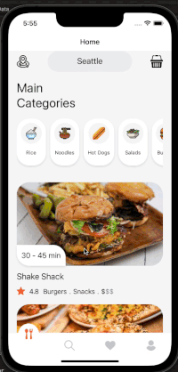

# Food Delivery
This is a cross-platform react-native app for food delivery services which uses google map api
and google direction api to show the delivery direction. This project creates the
UI of a food delivery app and allows user to select items to order from different
restaurants. The data of addresses and restaurants here are all dummy data.

# Category

\
In the home screen, users can select the category tag to filter out the restaurants
of which they are not interested in.

# Order and Delivery Direction

\
After clicking the desired restaurant, users can swipe to select the item to order.
If the users decided to checkout, this application will take the user's current gps location
as the start, the restaurant's location as the destination. Both the start and destination
would be shown in the embedded google map, and the route would be calculated from the google
direction api.
